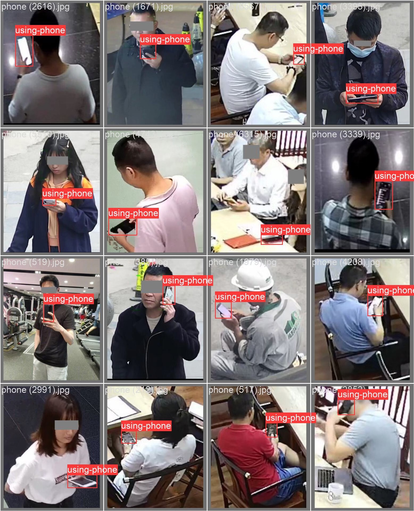

# Calling and using mobile phones for target detection dataset, 8200 images, with annotations, supporting VOC.

## Body

Calling for a dataset of phone-call detection in the context of mobile phone usage, consisting of 8200 images with annotations. Supports VOC and YOL formats.
Available at the moment, just hit "Buy Now" to get it instantly. The virtual data is ready at any time.
If you need it, just hit "Buy Now". You can discuss the details if needed. (C015)

## Images

## Payment

Here is a pay link on Stripe ( https://buy.stripe.com/3cs8yP7sY87d0vu9AB ). Please contact me lonlonago@foxmail.com after funding $89, and I will send you a complete data files , thank you!

